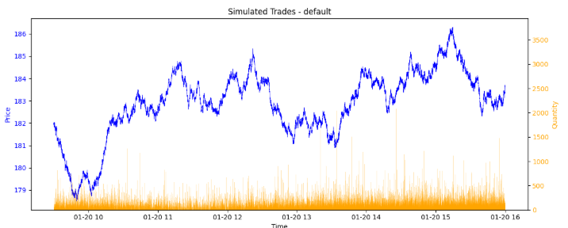
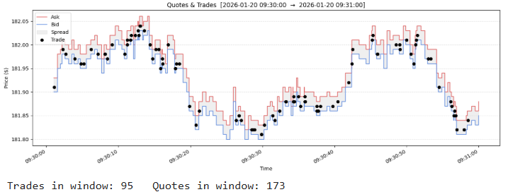

# Notebooks

A PyKX notebook is provided to help you get started quickly. It walks through loading the module, running a simulation with a preset, and plotting the results — useful if you're new to PyKX or want to verify everything is working.

### Setup
```bash
cd di/simtick
python -m venv .venv
source .venv/bin/activate   # Linux/Mac
pip install -r requirements.txt
jupyter lab
```

### Available

| Notebook | Description |
|----------|-------------|
| `simtickDemo.ipynb` | Getting started — load module, run simulation, plot price and trade volume |

---

## simtickDemo walkthrough

### 1. Price and volume overview

Runs the simulator with a chosen preset and plots the full day: trade prices on the left axis, trade volumes as bars on the right axis.



### 2. Quote and trade consistency check

Re-runs the simulation with `generatequotes:1b` and zooms into a configurable time window (`ts1` → `ts2`). Bid and ask are shown as step lines with the spread shaded; trade prices are overlaid as dots. Any trade that printed outside the prevailing bid/ask is circled in red.


